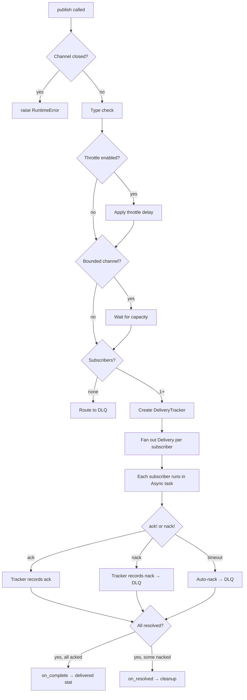

# Publish Flow

When you call `channel.publish(message)`, the following steps execute in order:

## Step-by-Step

### 1. Guard: Closed Channel

If the channel is closed, `publish` raises `RuntimeError`. No message is delivered.

### 2. Type Check

If the channel has a `type:` constraint, the message's class is verified with `is_a?`. A mismatch raises `ArgumentError`.

### 3. Throttle

If `throttle` is configured and the channel is bounded, the remaining capacity ratio is checked. Below the threshold, the publisher sleeps for `1 / (max_pending * remaining_ratio)` seconds — an asymptotic delay that approaches infinity as remaining capacity approaches zero.

### 4. Backpressure

If the channel is bounded (`max_pending` is set) and the pending delivery count has reached the limit, the publishing fiber blocks on an `Async::Condition` until a subscriber ACKs and frees a slot.

### 5. Fan-Out

A `DeliveryTracker` is created for this message, tracking the set of current subscriber IDs. Each subscriber receives its own `Delivery` envelope in a separate `Async` task.

### 6. Resolution

Each subscriber must call `ack!` or `nack!` on its Delivery. If neither is called before the timeout, the delivery auto-nacks. The tracker aggregates responses:

- **All acked** — the `on_complete` callback fires, incrementing the `:delivered` stat.
- **Any nacked** — the `on_resolved` callback fires for cleanup. NACKed deliveries are pushed to the dead letter queue.

### 7. Backpressure Release

When a tracker resolves, the pending delivery is removed and `@backpressure.signal` wakes any blocked publisher fiber.

## No-Subscriber Path

If there are no subscribers when `publish` is called, the message is wrapped in a Delivery, immediately NACKed, and pushed to the dead letter queue. The `:nacked` and `:dead_lettered` stats are incremented.
