# Backpressure

Set `max_pending` to bound how many unresolved deliveries a channel allows. When the limit is reached, `publish` blocks the calling fiber until subscribers ACK and free capacity.

## Enabling Backpressure

```ruby
channel = TypedBus::Channel.new(:work,
  max_pending: 100,
  timeout: 10
)
```

Or via MessageBus:

```ruby
bus.add_channel(:work, max_pending: 100)
```

Or via the configuration cascade:

```ruby
TypedBus.configure { |c| c.max_pending = 500 }
bus = TypedBus::MessageBus.new
bus.add_channel(:work)  # inherits max_pending=500
```

## How It Works

```mermaid
sequenceDiagram
    participant P as Publisher Fiber
    participant C as Channel
    participant S as Subscriber Fiber

    P->>C: publish(msg)
    C-->>C: pending_count >= max_pending?
    Note over C: YES — block publisher
    S->>C: delivery.ack!
    C-->>C: pending_count drops
    C->>P: resume (signal)
    P->>C: publish continues
```



1. Before fan-out, the channel checks `pending_deliveries.size >= max_pending`
2. If at capacity, the publishing fiber waits on an `Async::Condition`
3. When any delivery tracker resolves (all subscribers responded), the condition signals
4. The publisher wakes and proceeds

## Unbounded Channels

Set `max_pending: nil` (the default) for unbounded channels. Publishers never block.

## Interaction with Throttling

When both `max_pending` and `throttle` are set, throttling runs first. The throttle progressively slows publishers as capacity fills; backpressure is the hard stop at zero remaining capacity.

See [Adaptive Throttling](adaptive-throttling.md) for details.
